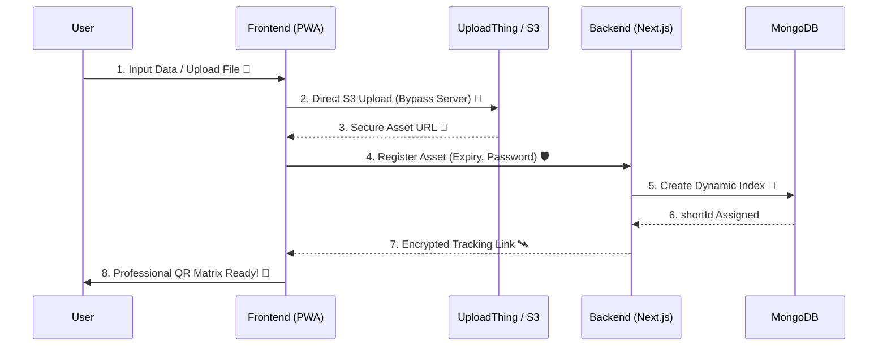

<div align="center">
  
  
  # 🚀 QuickQR
  **The Elite, High-Performance QR Matrix Engine for Links & Media.**
  
  [](https://nextjs.org/)
  [](https://tailwindcss.com/)
  [](https://mongodb.com/)
  [](https://uploadthing.com/)
</div>

<br/>

**QuickQR** is a premium, progressive web application (PWA) designed to transform digital assets—URLs, documents, audio, and large-scale videos—into high-fidelity, rapid-scanning QR matrices. Featuring a modular architecture, real-time dynamic routing, and professional-grade customization.

---

## ⚡ How it Works (The Magic)



---

## ✨ Features that Wow

- **📂 Multi-Format Engine:** Support for URLs, Documents (PDF/DOCX), Videos (MP4/MKV), and Audio (MP3/WAV).
- **📦 Dynamic Batch Processor:** Generate hundreds of QR codes at once with individual categorization (Instagram, GitHub, etc.) and auto-naming.
- **🛡️ Shield Protocol:** 4-Digit PIN protection gateway for sensitive enterprise documents and media.
- **⏳ Pulse Expiry (TTL):** Set precision expiration windows (1h, 1d, 7d, 30d) that auto-purge from the database.
- **🎨 Advanced QR Customizer:** Premium gradients, unique dot styles (Classy Curves, Sharp Squares), and custom logo embedding.
- **📱 Responsive by Design:** Seamless, modular UI built for Desktop, Tablet, and Mobile with scrollable navigation and fit-to-view layouts.
- **📦 Native PWA:** Install it on your device for a full native browser-less experience.

---

## 🛠️ Tech Stack & Architecture

QuickQR follows the **Modular Edge Architecture**, separating persistence layers from asset delivery for maximum velocity.

*   **⚡ Framework:** [Next.js 15](https://nextjs.org/) (App Router, Server Actions)
*   **💎 Styling:** [Tailwind CSS v3](https://tailwindcss.com/) & [MagicUI](https://magicui.design/) Components
*   **🏗️ Hooks Pattern:** Custom hooks for state management (`useQRGenerator`, `useBatchGenerator`)
*   **🔋 Database:** [MongoDB](https://www.mongodb.com/) (NoSQL Persistence)
*   **☁️ Storage:** [UploadThing](https://uploadthing.com/) (Secure S3 Edge Uploads)
*   **🧩 Icons:** [Lucide React](https://lucide.dev/)

---

## 🏗️ Folder Structure (Clean & Modular)

```text
QuickQR/
├── 📁 app/             # Next.js App Router (Views & API)
├── 📁 components/      # UI Components (Shadcn + Custom)
├── 📁 hooks/           # Custom React Hooks (Logic abstraction)
├── 📁 lib/             # Utility functions & Shared Config
├── 📁 models/          # Database Schemas (MongoDB)
├── 📁 public/          # Optimized Static Assets
└── ⚙️ tailwind.config.ts # Professional Design Tokens
```

---

## 🚀 Getting Started

### Prerequisites
- Node.js 20.x+
- MongoDB Instance
- UploadThing API Keys

### Installation & Launch

1. **Clone the matrix:**
   ```bash
   git clone https://github.com/CodeWithBasu/QuickQR.git
   cd QuickQR
   ```

2. **Initialize dependencies:**
   ```bash
   npm install
   ```

3. **Configure the environment (`.env.local`):**
   ```env
   MONGODB_URI="your_mongodb_connection_string"
   UPLOADTHING_TOKEN="your_uploadthing_token"
   ```

4. **Power Up:**
   ```bash
   npm run dev
   ```

---

## 🔒 Security First

*   **Database TTL Indexes:** Expired shortlinks use native Mongo eviction to ensure zero-stale-data overhead.
*   **Edge Routing:** Scan redirection happens at the edge to ensure minimum latency.
*   **Modular Cleanup:** Periodic automatic removal of unusual files and redundant public assets to keep the codebase pristine.

---

<p align="center">
  Crafted with ❤️ by <b>Basudev Moharana</b><br/>
  <i>Pristine Matrices for a Modern Web.</i><br/>
  &copy; 2026 QuickQR Engine.
</p>