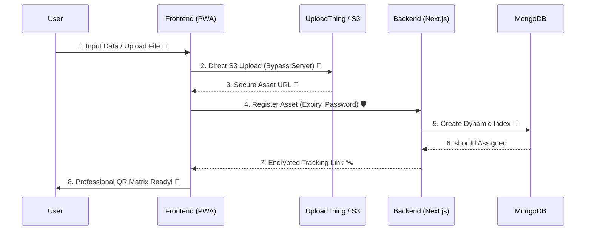

<div align="center">
  
  
  # 🚀 QuickQR
  **The Elite, High-Performance QR Matrix Engine for Links & Media.**
  
  [](https://nextjs.org/)
  [](https://tailwindcss.com/)
  [](https://mongodb.com/)
  [](https://uploadthing.com/)
</div>

<br/>

**QuickQR** is a premium, progressive web application (PWA) designed to transform digital assets—URLs, documents, audio, and large-scale videos—into high-fidelity, rapid-scanning QR matrices. Featuring a modular architecture, real-time dynamic routing, and professional-grade customization.

---

## ⚡ How it Works (The Magic)



---

## 🔥 Key Repository Features

### 🛠️ Versatile QR Generation Modules
QuickQR isn't just a link shortener; it's a full-suite matrix engine:
- **🔗 Smart URL Generator:** Clean, tracking-enabled links for any web destination.
- **📄 Document Vault:** Securely host and share PDFs, DOCX, and Text files (Up to 64MB).
- **🎬 Cinematic Video:** High-speed streaming for MP4, MKV, and MOV (Up to 128MB).
- **🎵 Crystal Audio:** Direct-play matrices for MP3 and WAV (Up to 64MB).
- **📡 WiFi Auto-Connect:** Instant SSID and Password encoding for seamless guest access.
- **📇 Pro Business Card (vCard):** Full contact details including Social (LinkedIn, GitHub, Insta) in one scan.
- **📦 Dynamic Batch Engine:** Generate, categorize, and download hundreds of QRs in a single `.zip` bundle.

### 🛡️ Enterprise-Grade Security (The Shield)
- **4-Digit PIN Protection:** Add a mandatory security gateway to any QR link.
- **Contextual Redirection:** smartphone cameras display the *actual filename* in the preview for higher trust.
- **Pulse Expiry (TTL):** Automated database eviction of expired links (1h to 30d).

### 🎨 Design & Performance
- **Custom Designer:** Gradients, unique dot styles, and logo overlays.
- **Modern Tech:** Next.js 15, React 19, MongoDB, and Tailwind CSS.
- **Optimized View:** Adaptive layout that fits perfectly on Mobile, Tablet, and Desktop.
- **Native PWA:** Full offline manifest support for home-screen installation.

---

## 🛠️ Tech Stack & Architecture

QuickQR follows the **Modular Edge Architecture**, separating persistence layers from asset delivery for maximum velocity.

*   **⚡ Framework:** [Next.js 15](https://nextjs.org/) (App Router, Server Actions)
*   **💎 Styling:** [Tailwind CSS v3](https://tailwindcss.com/) & [MagicUI](https://magicui.design/) Components
*   **🏗️ Hooks Pattern:** Custom hooks for state management (`useQRGenerator`, `useBatchGenerator`)
*   **🔋 Database:** [MongoDB](https://www.mongodb.com/) (NoSQL Persistence)
*   **☁️ Storage:** [UploadThing](https://uploadthing.com/) (Secure S3 Edge Uploads)
*   **🧩 Icons:** [Lucide React](https://lucide.dev/)

---

## 🏗️ Folder Structure (Clean & Modular)

```text
QuickQR/
├── 📁 app/             # Next.js App Router (Views & API)
├── 📁 components/      # UI Components (Shadcn + Custom)
├── 📁 hooks/           # Custom React Hooks (Logic abstraction)
├── 📁 lib/             # Utility functions & Shared Config
├── 📁 models/          # Database Schemas (MongoDB)
├── 📁 public/          # Optimized Static Assets
└── ⚙️ tailwind.config.ts # Professional Design Tokens
```

---

## 🚀 Getting Started

### Prerequisites
- Node.js 20.x+
- MongoDB Instance
- UploadThing API Keys

### Installation & Launch

1. **Clone the matrix:**
   ```bash
   git clone https://github.com/CodeWithBasu/QuickQR.git
   cd QuickQR
   ```

2. **Initialize dependencies:**
   ```bash
   npm install
   ```

3. **Configure the environment (`.env.local`):**
   ```env
   MONGODB_URI="your_mongodb_connection_string"
   UPLOADTHING_TOKEN="your_uploadthing_token"
   ```

4. **Power Up:**
   ```bash
   npm run dev
   ```

---

## 🔒 Security First

*   **Database TTL Indexes:** Expired shortlinks use native Mongo eviction to ensure zero-stale-data overhead.
*   **Edge Routing:** Scan redirection happens at the edge to ensure minimum latency.
*   **Modular Cleanup:** Periodic automatic removal of unusual files and redundant public assets to keep the codebase pristine.

---

<p align="center">
  Crafted with ❤️ by <b>Basudev Moharana</b><br/>
  <i>Pristine Matrices for a Modern Web.</i><br/>
  &copy; 2026 QuickQR Engine.
</p>