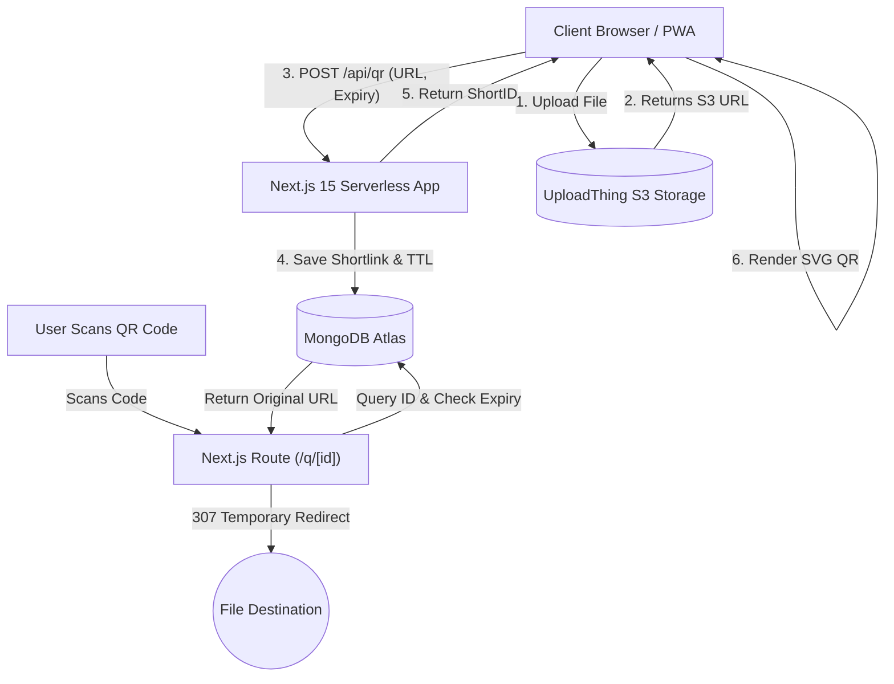

<div align="center">
  
  
  # QuickQR
  **The Modern, High-Performance QR Generator for Links & Media.**
  
  [](https://nextjs.org/)
  [](https://tailwindcss.com/)
  [](https://mongodb.com/)
  [](https://uploadthing.com/)
</div>

<br/>

**QuickQR** is a premium, progressive web application (PWA) built to securely convert standard URLs, documents, audio files, and large videos into rapid-scanning QR codes. It features a sleek glassmorphic UI, real-time native upload progress, and a highly scalable backend architecture.

---

## ✨ Features

- **Multi-Format Support:** Generate QR Codes for plain URLs, Documents (PDF/DOCX up to 64MB), Videos (up to 128MB), and Audio (up to 64MB).
- **Time-to-Live (TTL) Shortlinks:** Automatically expire and delete QR links after 1 hour, 1 day, 7 days, or 30 days to maximize cloud security and storage efficiency.
- **Progressive Web App (PWA):** Installs natively on desktop and mobile operating systems with custom glossy app icons.
- **Ultra-Premium UI/UX:** Built with Tailwind CSS, Framer Motion, and Radix primitives (Shadcn UI), featuring glowing dot-pattern backgrounds and seamless glassmorphic panels.
- **One-Click Download:** Download generated, high-resolution SVG QR codes immediately as PNG files.

---

## 🏗️ System Architecture

QuickQR leverages a modern serverless edge architecture separating massive file uploads from the primary database cluster.



### Flow Breakdown:
1. **Uploads:** Files bypass the Next.js server and securely upload directly to **UploadThing** (AWS S3-backed) for high-speed streaming capability.
2. **Link Shortening:** The destination URL (or new S3 URL) is passed to a Next.js API route resulting in an alphanumeric `shortId`. This record is preserved in **MongoDB**.
3. **Redirection Layer:** Scanning the code takes the user to `yourdomain.com/q/[id]`. The server interrogates MongoDB, ensures the link has not expired, and seamlessly redirects the user to the destination.

---

## 🛠️ Tech Stack

- **Framework:** [Next.js 15](https://nextjs.org/) (React 19, App Router)
- **Styling:** [Tailwind CSS v3](https://tailwindcss.com/) & [Shadcn UI](https://ui.shadcn.com/)
- **Icons:** [Lucide React](https://lucide.dev/)
- **Database:** [MongoDB](https://www.mongodb.com/) via [Mongoose](https://mongoosejs.com/)
- **File Storage:** [UploadThing](https://uploadthing.com/)
- **QR Generation:** `qrcode.react`
- **PWA Capabilities:** `@ducanh2912/next-pwa`

---

## 🚀 Getting Started

### Prerequisites
- Node.js version 20.x or higher
- A MongoDB cluster URL
- An UploadThing App Token

### Installation

1. **Clone the repository:**
   ```bash
   git clone https://github.com/CodeWithBasu/QuickQR.git
   cd QuickQR
   ```

2. **Install dependencies:**
   ```bash
   npm install
   ```

3. **Configure Environment Variables:**
   Rename `.env.example` to `.env.local` and add your database and storage credentials.
   ```env
   # MongoDB Connection String
   MONGODB_URI="mongodb+srv://<username>:<password>@cluster0.mongodb.net/quickqr"

   # UploadThing Secret Tokens
   UPLOADTHING_TOKEN="your_uploadthing_token_here"
   ```

4. **Run the Development Server:**
   ```bash
   npm run dev
   ```

5. **Open the App:**
   Navigate to [http://localhost:3000](http://localhost:3000)

---

## 🔒 Security & Performance Features

- **Database TTL Indexes:** Expired shortlinks use native MongoDB TTL index eviction processes to delete objects.
- **Client-Side Generation:** The actual visual SVG of the QR code is generated strictly in the browser window, saving massive server rendering costs. 
- **Type-Safety:** Enforced deeply across all frontend components and backend schemas.

---

<p align="center">
  Developed with passion for modern web technologies. <br/>
  &copy; QuickQR Project.
</p>